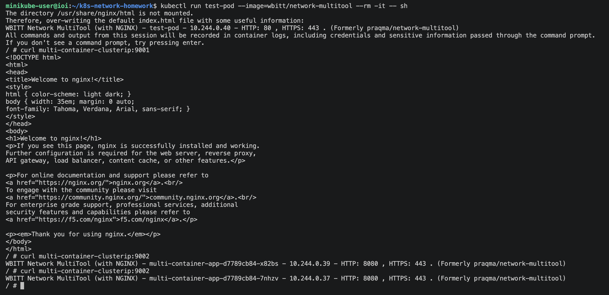
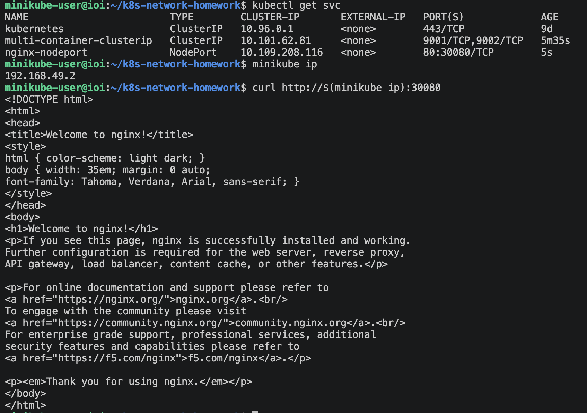
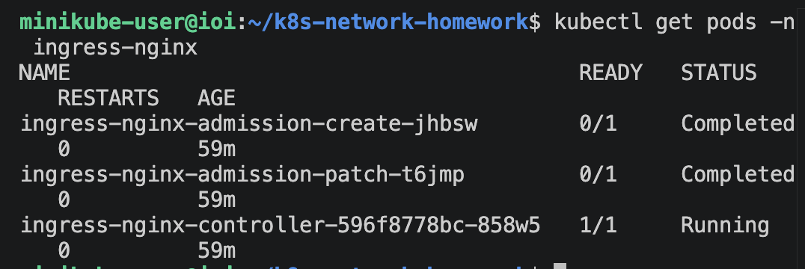
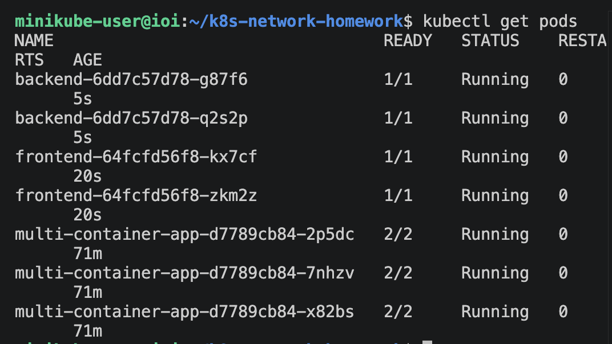
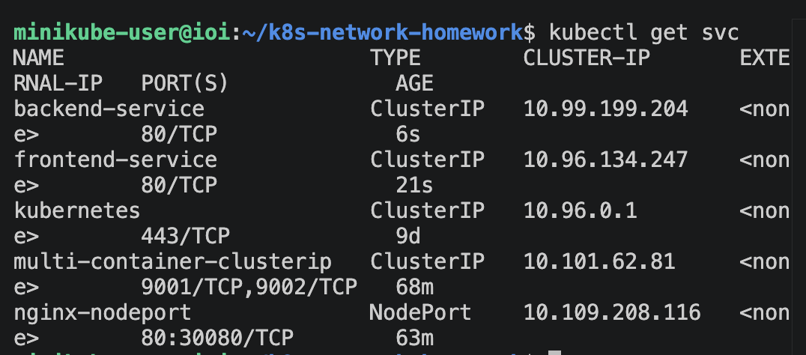
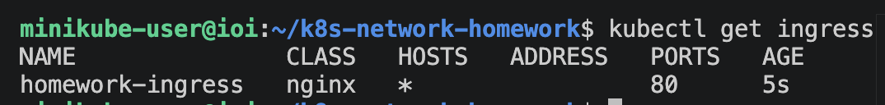
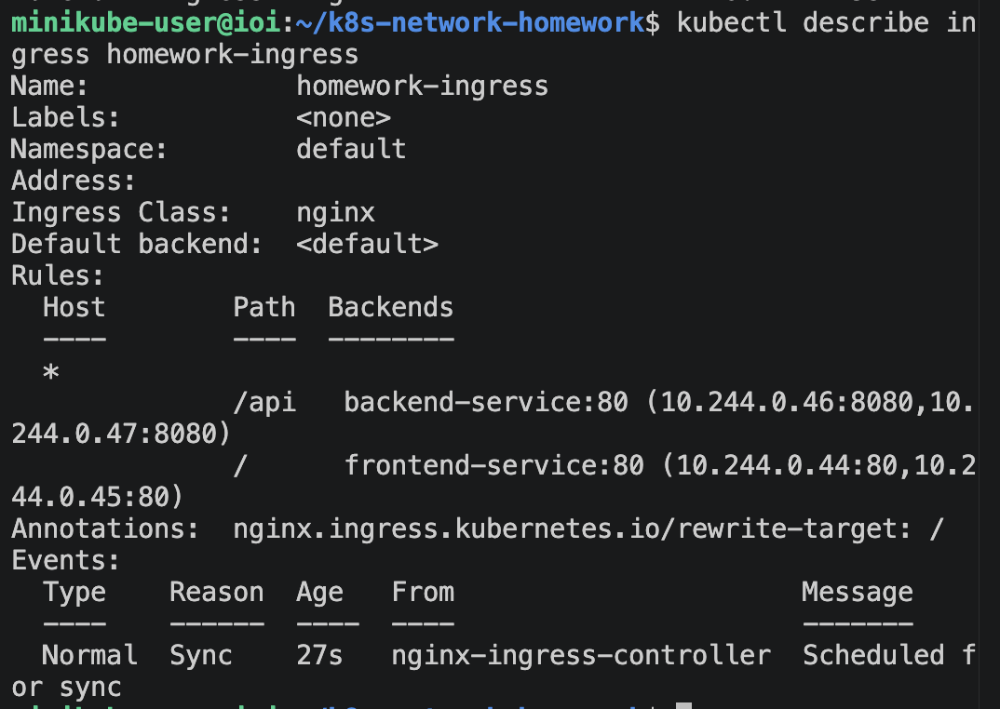
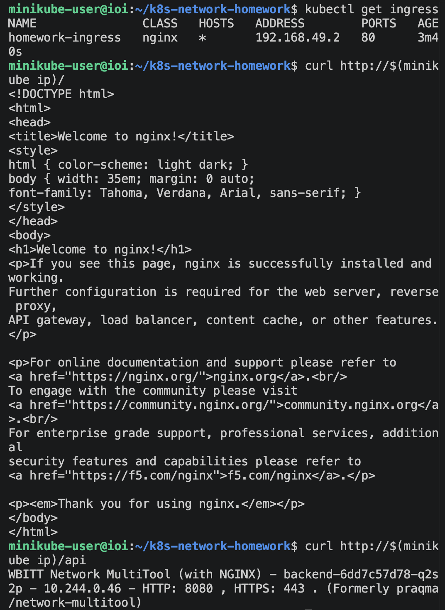

Манифест Deployment

Файл: deployment-multi-container.yaml

apiVersion: apps/v1
kind: Deployment
metadata:
  name: multi-container-app
spec:
  replicas: 3
  selector:
    matchLabels:
      app: multi-container-app
  template:
    metadata:
      labels:
        app: multi-container-app
    spec:
      containers:
        - name: nginx
          image: nginx
          ports:
            - containerPort: 80
        - name: multitool
          image: wbitt/network-multitool
          ports:
            - containerPort: 8080
          env:
            - name: HTTP_PORT
              value: "8080"

Deployment создаёт три Pod’а. В каждом Pod находится два контейнера: nginx и multitool.

Проверка созданных Pod’ов:

kubectl get pods

⸻

Service типа ClusterIP

Файл: service-clusterip.yaml

apiVersion: v1
kind: Service
metadata:
  name: multi-container-clusterip
spec:
  type: ClusterIP
  selector:
    app: multi-container-app
  ports:
    - name: nginx
      protocol: TCP
      port: 9001
      targetPort: 80
    - name: multitool
      protocol: TCP
      port: 9002
      targetPort: 8080

Этот Service используется для доступа к приложению внутри Kubernetes-кластера.

Проверка Service:

kubectl get svc

⸻

Проверка доступа через ClusterIP

Так как ClusterIP доступен только внутри кластера, проверка выполнялась из временного Pod’а:

kubectl run test-pod --image=wbitt/network-multitool --rm -it -- sh

Проверка доступа к nginx:

curl multi-container-clusterip:9001

В результате была получена стандартная страница nginx.

Проверка доступа к multitool:

curl multi-container-clusterip:9002

В результате был получен ответ от контейнера multitool.

Также видно, что при повторных запросах ответы приходят от разных Pod’ов. Это подтверждает, что Service распределяет трафик между репликами приложения.

⸻

Service типа NodePort

Файл: service-nodeport.yaml

apiVersion: v1
kind: Service
metadata:
  name: nginx-nodeport
spec:
  type: NodePort
  selector:
    app: multi-container-app
  ports:
    - name: nginx
      protocol: TCP
      port: 80
      targetPort: 80
      nodePort: 30080

Этот Service используется для доступа к nginx снаружи кластера.

Проверка Service:

kubectl get svc

В выводе видно, что Service nginx-nodeport доступен на порту 30080.

⸻

Проверка доступа через NodePort

IP Minikube:

minikube ip

Результат:

192.168.49.2

Проверка доступа:

curl http://$(minikube ip):30080

В результате была получена стандартная страница nginx.

⸻

Задание 2. Настройка Ingress

Цель

Развернуть два приложения:

* frontend на базе образа nginx;
* backend на базе образа wbitt/network-multitool.

После этого необходимо было настроить маршрутизацию через Ingress:

* / направляется на frontend;
* /api направляется на backend.

⸻

Включение Ingress-контроллера

В Minikube Ingress был включён командой:

minikube addons enable ingress

Проверка работы Ingress-контроллера:

kubectl get pods -n ingress-nginx

Ingress-контроллер находится в статусе Running.

⸻

Deployment frontend

Файл: deployment-frontend.yaml

apiVersion: apps/v1
kind: Deployment
metadata:
  name: frontend
spec:
  replicas: 2
  selector:
    matchLabels:
      app: frontend
  template:
    metadata:
      labels:
        app: frontend
    spec:
      containers:
        - name: nginx
          image: nginx
          ports:
            - containerPort: 80

⸻

Deployment backend

Файл: deployment-backend.yaml

apiVersion: apps/v1
kind: Deployment
metadata:
  name: backend
spec:
  replicas: 2
  selector:
    matchLabels:
      app: backend
  template:
    metadata:
      labels:
        app: backend
    spec:
      containers:
        - name: multitool
          image: wbitt/network-multitool
          ports:
            - containerPort: 8080
          env:
            - name: HTTP_PORT
              value: "8080"

Проверка Pod’ов после создания frontend и backend:

kubectl get pods

⸻

Service для frontend

Файл: service-frontend.yaml

apiVersion: v1
kind: Service
metadata:
  name: frontend-service
spec:
  type: ClusterIP
  selector:
    app: frontend
  ports:
    - name: http
      protocol: TCP
      port: 80
      targetPort: 80

⸻

Service для backend

Файл: service-backend.yaml

apiVersion: v1
kind: Service
metadata:
  name: backend-service
spec:
  type: ClusterIP
  selector:
    app: backend
  ports:
    - name: http
      protocol: TCP
      port: 80
      targetPort: 8080

Проверка Service:

kubectl get svc

⸻

Ingress

Файл: ingress.yaml

apiVersion: networking.k8s.io/v1
kind: Ingress
metadata:
  name: homework-ingress
  annotations:
    nginx.ingress.kubernetes.io/rewrite-target: /
spec:
  ingressClassName: nginx
  rules:
    - http:
        paths:
          - path: /api
            pathType: Prefix
            backend:
              service:
                name: backend-service
                port:
                  number: 80
          - path: /
            pathType: Prefix
            backend:
              service:
                name: frontend-service
                port:
                  number: 80

Ingress принимает HTTP-запросы и перенаправляет их в нужный Service.

Маршрутизация работает следующим образом:

http://192.168.49.2/      → frontend-service → frontend Pod → nginx
http://192.168.49.2/api   → backend-service  → backend Pod  → multitool

Проверка Ingress:

kubectl get ingress

⸻

Проверка доступа к frontend через Ingress

Команда:

curl http://$(minikube ip)/

В результате была получена стандартная страница nginx.

⸻

Проверка доступа к backend через Ingress

Команда:

curl http://$(minikube ip)/api

В результате был получен ответ от backend-приложения multitool.

⸻

Итог

В ходе выполнения домашнего задания были настроены:

* Deployment с двумя контейнерами в одном Pod;
* Service типа ClusterIP для внутреннего доступа;
* Service типа NodePort для внешнего доступа;
* отдельные Deployment для frontend и backend;
* Service для frontend и backend;
* Ingress для маршрутизации запросов по путям / и /api.

Проверки подтвердили, что:

* nginx доступен внутри кластера через multi-container-clusterip:9001;
* multitool доступен внутри кластера через multi-container-clusterip:9002;
* nginx доступен снаружи через NodePort на порту 30080;
* frontend доступен через Ingress по пути /;
* backend доступен через Ingress по пути /api.
